<center style>

<div style="background:#111; padding:20px; display:inline-block; border-radius:12px;">
  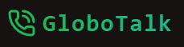
</div>

</center>

## GloboTalk - Talk Globally.

Connect globally, practice naturally, and learn faster through real conversations in a social-media-like experience.

> Live URL: https://comingsoon.com

## Tech Stack

- React
- React Router
- Tailwind
- Vite (Bundler)
- Zustand (State Management)
- Tanstack Query (API State Management)
- Custom Hooks (Mostly for react Query)
- Lucide-React-Icons
- Stream io (Chat / Call Provider)
- Zod (Schema Validation)
- React Hook Form (For Form Handling)
- Nodejs (Typescript)
- Express
- Mongoose
- JWT, Bcrypt.

### Project Screenshots

| Signup Page                                     |
| ------------------------------------------------ |
| 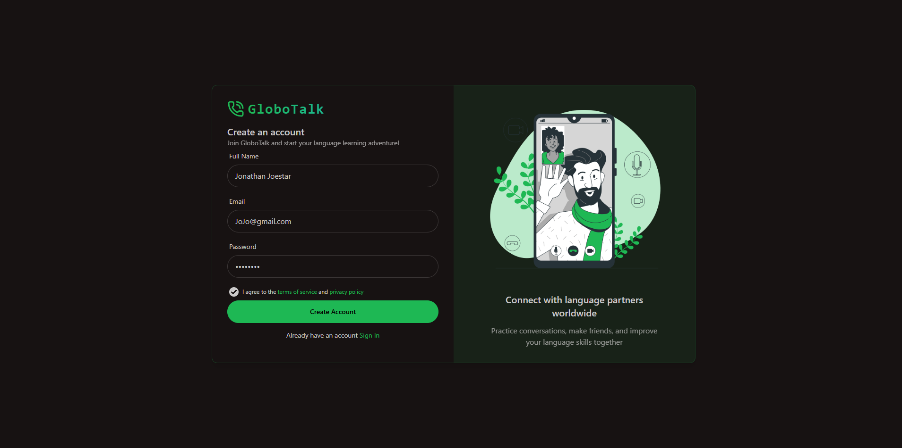 |

| Signup Page (With Validations)                                    |
| ------------------------------------------------- |
| 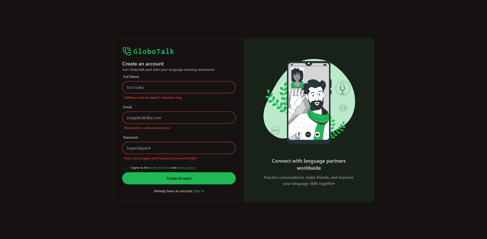 |

| Onboarding Page                 |
| ------------------------------------------------ |
| 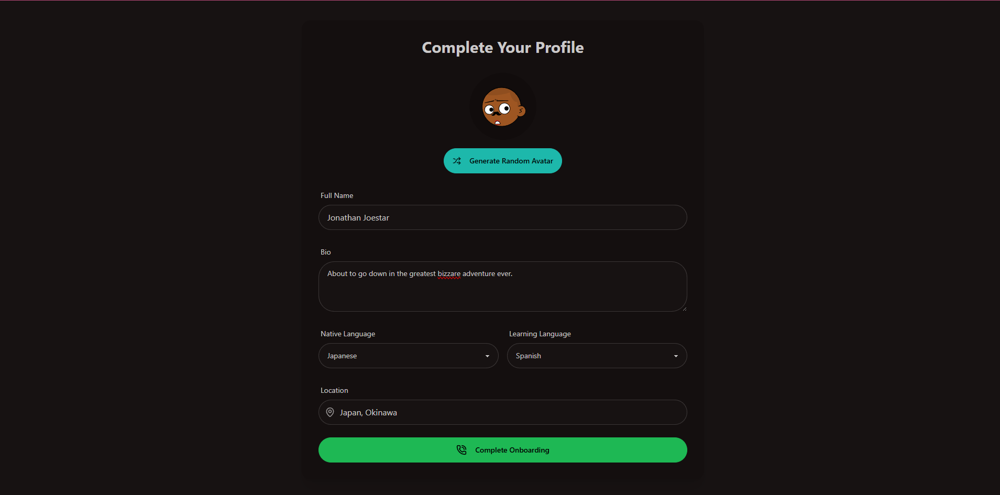 |

| Home Page (Dashboard)                 |
| ------------------------------------------------ |
| 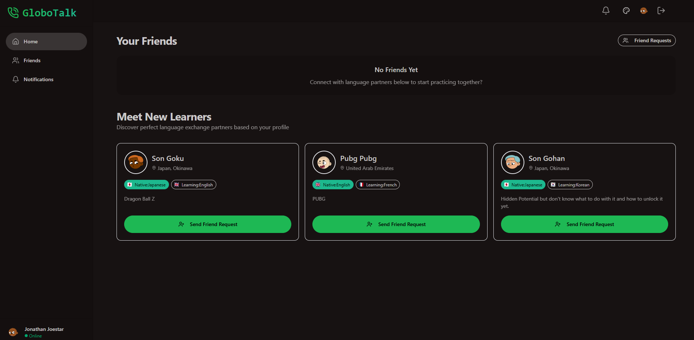 |

| Notifications Page|
| ------------------------------------------------ |
| 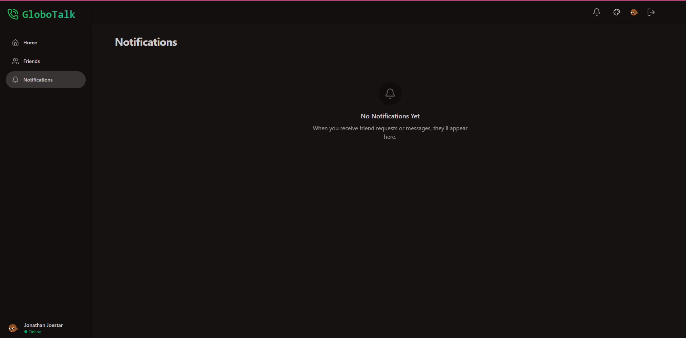 |

| Home Page (Theme Selector)                 |
| ------------------------------------------------ |
| 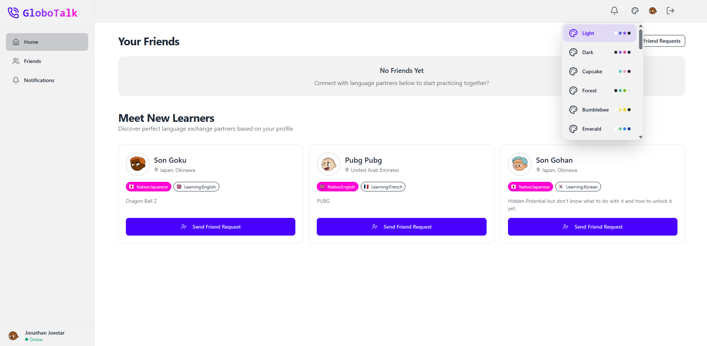 |

| Home Page (Friend Requests Sent)                 |
| ------------------------------------------------ |
|  |

| Notifiations Page (Friend Request Accept Action)                 |
| ------------------------------------------------ |
| 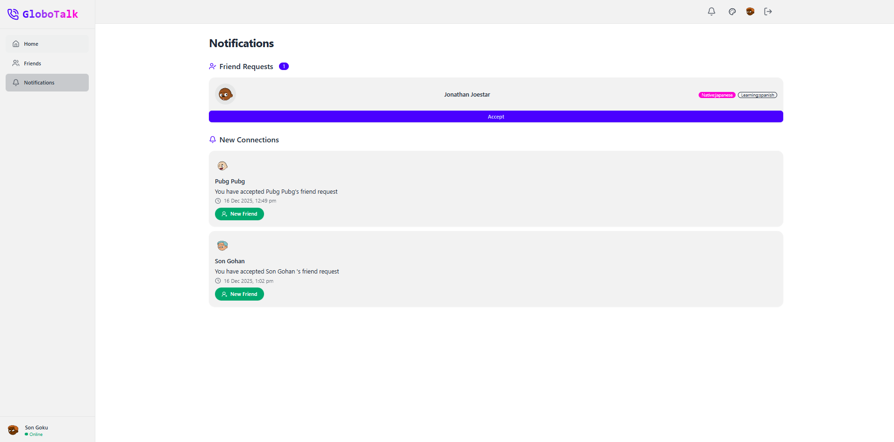 |

| Notifications Page (Friend Request Accepted)                 |
| ------------------------------------------------ |
| 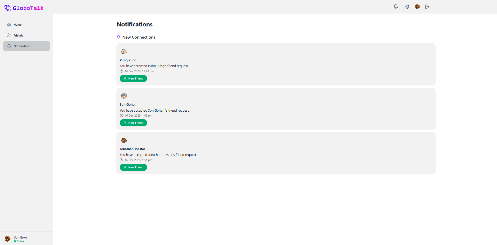 |

| Notifications Page (Friend Request Accepted - Opp View)                 |
| ------------------------------------------------ |
| 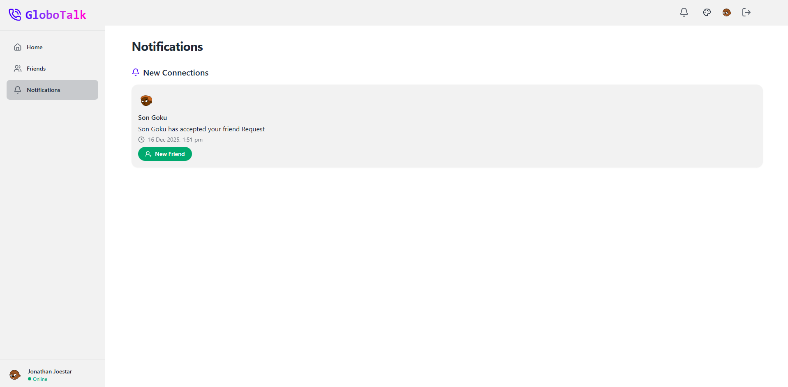 |

| Home Page (Friend List + Recommended Users)                 |
| ------------------------------------------------ |
| 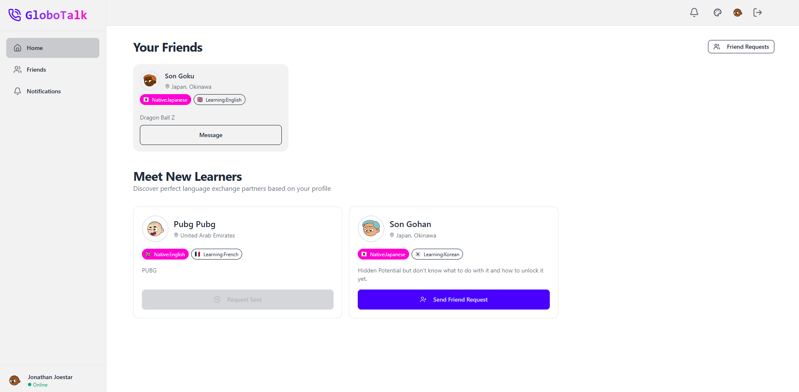 |

| Chat Page (Typing Status)                 |
| ------------------------------------------------ |
| 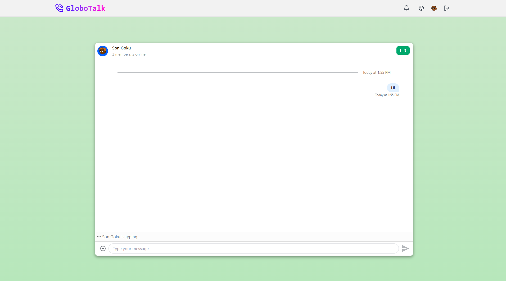 |

| Chat Page (With Msg Delete, Image, Reactions)                 |
| ------------------------------------------------ |
|  |

| Video Call Page (With Most Controls)                 |
| ------------------------------------------------ |
| 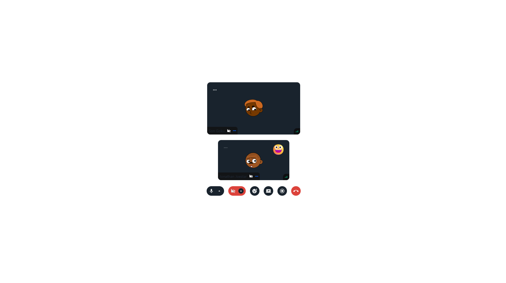 |

| Video Call Page (With Screen Share)                 |
| ------------------------------------------------ |
| 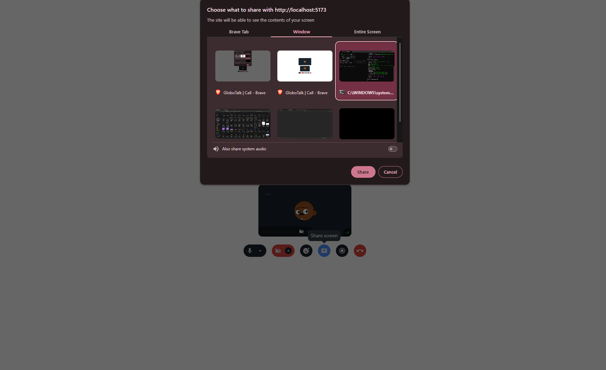 |


## Wanna Run in your Machine?

Clone the project

```bash
  git clone https://github.com/ShahbaazX786/globotalk.git
```

Go to the project directory

```bash
  cd globotalk 
  cd frontend -- to run the frontend
  cd backend -- to run the backend.
  Note: Both should be running for smoother dev exp.
```

Install dependencies

```bash
  npm install
```

Start the server

```bash
  npm run s or npm run start
```

## Environment Variables

```
Frontend
VITE_STREAM_API_KEY=
VITE_AVATAR_API_URL=

Backend:
PORT
DB_URI
STREAM_API_KEY
STREAM_API_SECRET
JWT_SECRET
ORIGIN
AVATAR_API
```

## Feedback

##### If you have any feedback, please reach out to me in below ways:

- LinkedIn - https://www.linkedin.com/in/shaik-shahbaaz-alam/
- Github - Just Dm me or raise a PR.
- Twitter / X - https://twitter.com/shahbaazx24
- Email - shahbaazalam78@gmail.com

## Support

For support, you can star 🌟 this repo or follow me on my social handles.s
